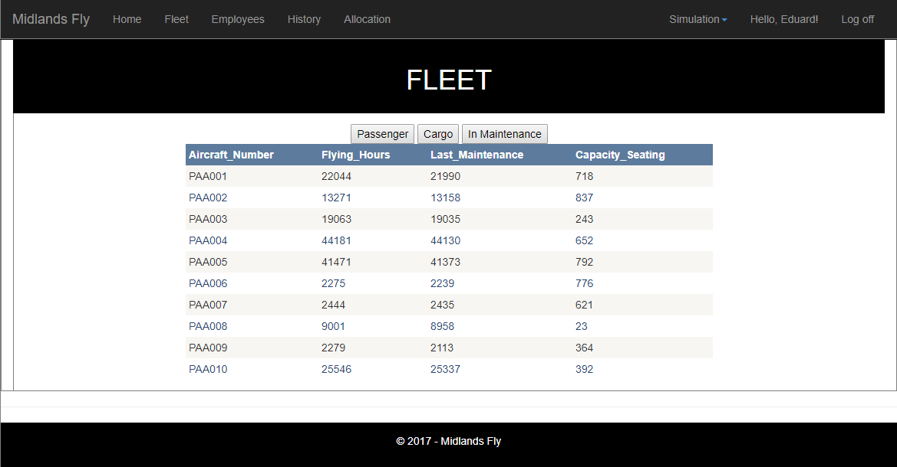

# Midlands Fly Database

*Midlands Fly Database is a coursework on subject "Internet Systems Development",
made for the Coventry University.*
*The goal of the project is to create a website that can grant access to a cloud database hosted on Microsoft Azure.*

## Usage

To use the coursework:

1. Download the project.
2. Run the solution.
3. Once the website opens, go to Simulation - New.
4. After a few seconds the database will be filled with entries.
5. Done, you can use the provided links to browse the database.
Note: You may have to alter the database connection string in order to use the website.

## Recommended Software

| Software |
| --- |
| Visual Studio 2017|
| Microsoft Azure	|
| Notepad++			|

## Used Languages

| Languages |
| --- |
|C#|
|HTLM|
|JavaScript|
|XML|
|T-SQL|

## References

<to be added>